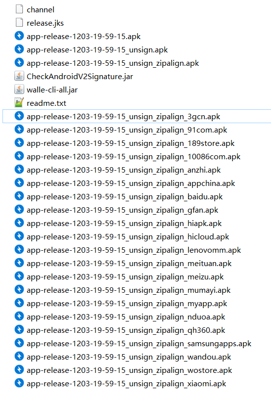

## Walle

Walle:Android Signature V2 Scheme签名下的新一代渠道包打包神器.
Tinker官方推荐的多渠道打包方式，

### Walle插件使用方式

**需求**

当渠道太多时，传统的Flavor方式打包时间过久。而采用Walle只需要很短的时间即可。重要的是支持Google最新推出的Android Signature V2 Scheme签名。

**实现**

项目的build.gradle

    buildscript {
        dependencies {
            classpath 'com.meituan.android.walle:plugin:1.1.5'
        }
    }
   
app\build.gradle
    
    apply plugin: 'walle'
    
    dependencies {
        compile 'com.meituan.android.walle:library:1.1.5'
    }
    
插件    
    
    walle {
        // 指定渠道包的输出路径
        apkOutputFolder = new File("${project.buildDir}/outputs/channels");
        // 定制渠道包的APK的文件名称
        apkFileNameFormat = '${appName}-${packageName}-${channel}-${buildType}-v${versionName}-${versionCode}-${buildTime}.apk';
        // 渠道配置文件
        channelFile = new File("${project.getProjectDir()}/channel")
    }
    
生成apk包

在Android studio下的Terminal命令工具中输入：（根目录是当前项目的目录）

    gradlew clean assembleReleaseChannels (生成全部渠道)
    gradlew clean assembleReleaseChannels -PchannelList=huawei,xiaomi （生成指定渠道）
    
在Terminal中看到，‘BUILD SUCCESSFUL in 28s’即可在build/outputs/apk/目录下看到生成好的渠道包。

代码中获取渠道信息

    String channel = WalleChannelReader.getChannel(this.getApplicationContext());

如果使用友盟渠道，需要在代码里设置

    MobclickAgent.startWithConfigure(new MobclickAgent.UMAnalyticsConfig(getApplicationContext(), "友盟渠道KEY", channel));

**与Tinker一起使用**

上面执行命令生成各渠道包的时候，build/bakApk 目录下同样生成类基础包和相关文件。参考 [README.md](README.md) 的方式打一个补丁，就可以修复所有渠道上APP的bug。

### Walle命令使用方式

**需求**

有时为了安全，我们需要对APP进行加密操作，加密之后签名失效，而采用Walle方式注入的渠道信息也会失效，就需要我们重新签名和注入渠道信息

**实现**

将打好的release包‘app-release-1203-19-59-15.apk’ 上传到加固平台加固，然后下载加固之后并未签名的包‘app-release-1203-19-59-15_unsign.apk’

1 zipalign 对齐

打开cmd，进入sdk下的build-tools目录下

    cd D:\Android\android-sdk\build-tools\26.0.2

2 执行zipalign命令进行对齐：

eg:zipalign -v 4 infile.zip outfile.zip

    zipalign -v 4 D:\walle\app-release-1203-19-59-15_unsign.apk D:\walle\app-release-1203-19-59-15_unsign_zipalign.apk

3 执行apksigner命令进行签名：

eg: apksigner sign --ks release.jks app.apk
    
    apksigner sign --ks ‪D:\walle\release.jks D:\walle\app-release-1203-19-59-15_unsign_zipalign.apk
    
4 通过[CheckAndroidV2Signature.jar](https://github.com/bihe0832/AndroidGetAPKInfo/blob/master/CheckAndroidV2Signature.jar)检查是否使用V2签名

eg:java -jar  CheckAndroidV2Signature.jar sign_zipalign.apk

    java -jar D:\walle\CheckAndroidV2Signature.jar D:\walle\app-release-1203-19-59-15_unsign_zipalign.apk
    
结果：{"ret":0,"msg":"ok","isV2":true,"isV2OK":true}   isV2OK代表是V2签名
    
5 通过[walle-cli-all.jar](https://github.com/Meituan-Dianping/walle/blob/master/walle-cli/walle-cli-all.jar)进行多渠道打包
    
eg: java -jar  walle-cli-all.jar pub ic channel.txt sign_zipalign.apk
    
    java -jar D:\walle\walle-cli-all.jar put -c D:\walle\channel ‪D:\walle\app-release-1203-19-59-15_unsign_zipalign.apk

channel 中保存的是所有渠道。

    meituan # 美团
    samsungapps #三星
    hiapk
    anzhi
    xiaomi # 小米
    91com
    gfan
    appchina
    nduoa
    3gcn
    mumayi
    10086com
    wostore
    189store
    lenovomm
    hicloud
    meizu
    wandou
    baidu
    qh360
    myapp

通过上述步骤就可完成多渠道打包。

所有涉及的文件：

    app-release-1203-19-59-15.apl   基础apk
    app-release-1203-19-59-15_unsign.apk   加固之后未签名的apk
    app-release-1203-19-59-15_unsign_zipalign.apk  zip对齐的apk  命令：zipalign
    CheckAndroidV2Signature.jar 检查是否使用V2签名
    walle-cli-all.jar  用来生成多渠道包

参考：

[（续）Android热更新：Tinker热修复与Walle多渠道打包](http://www.jianshu.com/p/18ed910e7b03)

[Walle（瓦力）多渠道打包](http://blog.csdn.net/blf09/article/details/72782795)